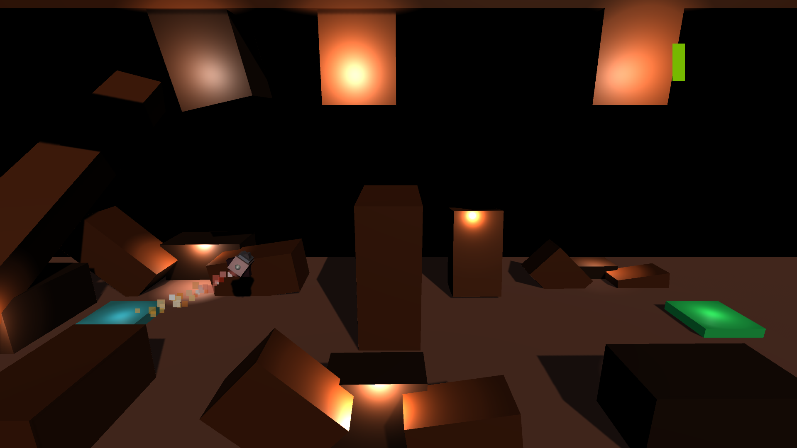
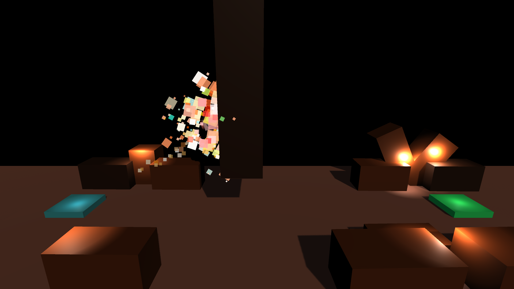
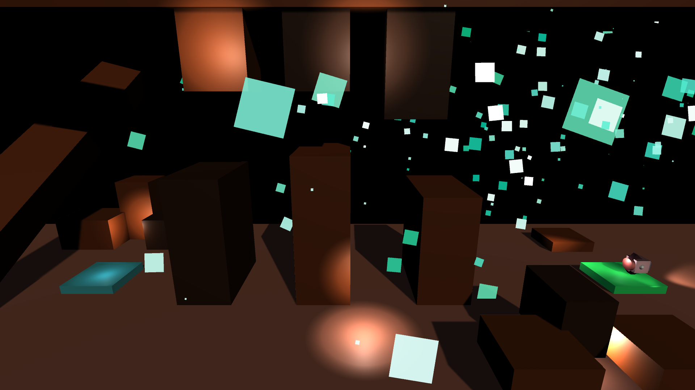

<!-- GAME PROJECT TITLE -->
# Project-Boost---Game
Game created for study purposes by Matheus Soares Martins, it is a game that you control a rocket and have to reach the landing pad while trying to avoid
bumping into obstacles. 
It have just three levels (was made for study only), but have the structure to be expanded and have how much levels wanted.
 

This game was made to be played by one player, and all you need is the keyboard to play this game
 

Game Controls 
- Player controls: 
Space - Makes the rocket goes up 
Left Arrow - Rotates the rocket to the left 
Right Arrow - Rotates the rocket to the right 

- Other controls: 
Esc - Closes the game 
F11 - Toggle between fullscreen and windowed mode. 
C - Disable objects collision detection. 
L - Finish the current level. 
******************************************************************************

 

<!-- GAME PROJECT IMAGES -->
# Screenshots

<!-- GAME PROJECT BUILDS -->
# Game download 
## Windows: https://mega.nz/folder/wYcH3IKC#0I_uu93uU47V5PnfbvQJdg
## Mac: https://mega.nz/folder/ERk0zRbI#_bR1JMRK7-7IeKHWcZLHHg
## Linux: https://mega.nz/folder/kdMTzJjB#6zU8islVWdo99E4jOV3vtg